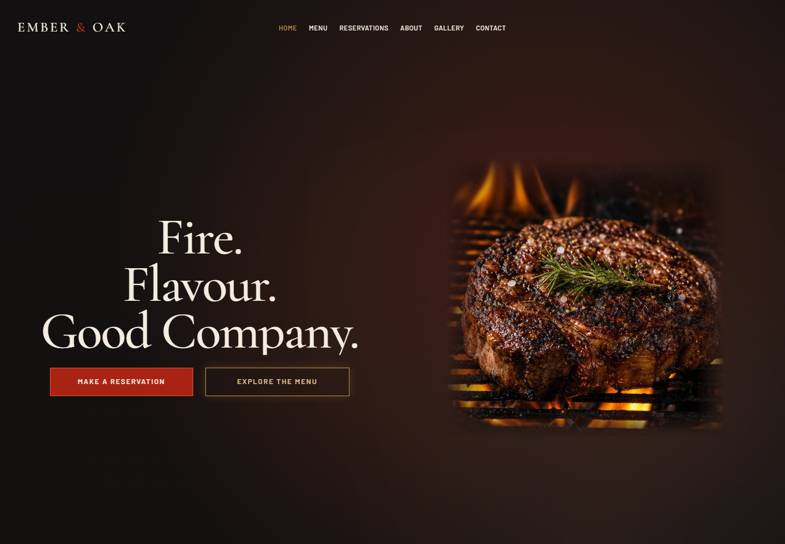
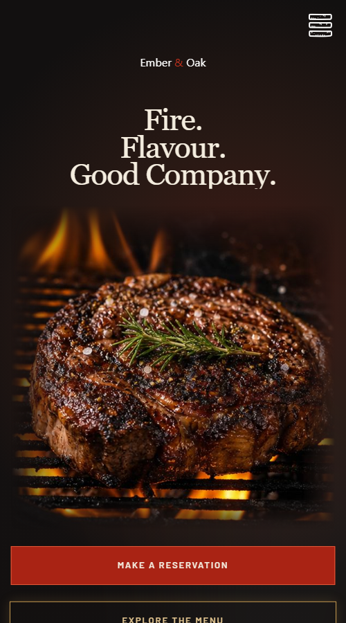

# Ember & Oak

Ember & Oak is a fictional wood-fired restaurant website created as a frontend portfolio project. The experience combines a dark, ember-lit atmosphere with tactile paper surfaces, editorial typography, responsive layouts, and accessible interactions.

[View the source repository](https://github.com/esbeeyay-323/RestaurantLandingPage)





## Highlights

- Responsive homepage, menu, reservations, about, gallery, contact, and custom 404 pages
- Filterable menu with Ghana cedi pricing
- Validated reservation and contact forms with demo submission notifications
- Keyboard-accessible mobile navigation and gallery lightbox
- Route-level code splitting, scroll restoration, and per-page metadata
- Reduced-motion support and semantic page structure
- Netlify and Vercel single-page application fallbacks

## Technology

- React 19
- TypeScript
- Vite
- React Router
- Tailwind CSS
- Ant Design

## Local development

```bash
npm install
npm run dev
```

Open the local URL printed by Vite.

## Quality checks

```bash
npm run lint
npm run test
npm run build
```

## Portfolio note

Ember & Oak is a fictional concept. The reservation and contact forms validate and demonstrate successful interactions, but they do not send data to a backend or create real bookings.

The restaurant address, telephone number, email address, opening hours, menu, and team profiles are presentation content for the concept.
